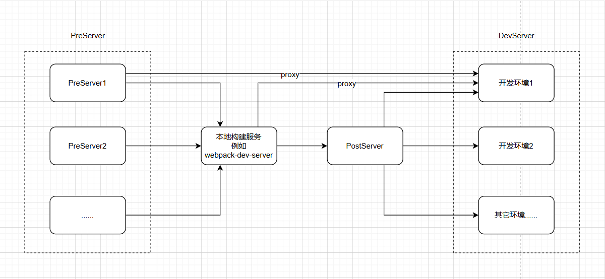

[![npm][npm]][npm-url]
[![node][node]][node-url]


# 开发环境管理插件

此项目是一个 开发环境管理 插件，使用 `Express` 启动新的服务器代理所有请求再转发到 `Dev Server`，经过在 `Dev Server`处理之后，`Dev Server` 可以将其他请求转发直接转发给环境服务器或者转发后置的代理服务器，由后置代理服务再次根据配置转发给对应的服务器。

## 功能

1. 支持 Webpack。
2. 可以独立启动
3. 使用 Express 和 http-proxy-middleware 将请求转发到 Dev Server。
4. 提供管理页面以启动和停止服务。

## 安装

```shell
npm i -D env-manage-plugin
```

### Webpack 中使用

```js
const path = require("path");
const EnvManagePlugin = require("env-manage-plugin");

module.exports = {
  ...
  plugins: [
    new EnvManagePlugin({
      basePath: "/env",
      envConfigPath: path.resolve(__dirname, "./env.config.js"),
    }),
  ],
};
```

配置之后，相关服务即可伴随 webpack 启动。

**_需要修改 webpack 的 devServe 的代理配置，将需要转发的请求转发到，后置服务器的地址。_**

### 独立启动

独立启动可以先全局安装

```cmd
npm i -g env-manage-plugin
```

使用 `npx envmanage` 即可启动，默认会搜索当前目录下的配置文件（env.config.js）。

访问管理页面：

```shell
http://localhost:3000/env
```

## 配置

### webpack 插件配置

#### envConfigPath

配置文件地址

默认值，当前目录下的 `env.config.js` 文件

#### port

后置服务器端口地址，默认为 `3000`，

#### basePath

管理页面首页基础地址，默认为 `/env`，如果和项目的路径出现冲突，可以通过这个调整。

### env.config.js

#### port

后置服务器端口地址，默认为 `3000`，

- 会覆盖插件配置
- 重载配置时，此属性不会重载

#### basePath

管理页面首页基础地址，默认为 `/env`，如果和项目的路径出现冲突，可以通过这个调整。

- 会覆盖插件配置
- 重载配置时，此属性不会重载

#### envList[] 环境列表

#### envListItem.name 环境名称

环境的名称，用于标识和区分不同的测试环境。例如，"1 号测试环境"。

#### envListItem.index 首页

首页地址，用于在管理页面展示跳转链接

#### envListItem.devServer 前置服务器配置

##### envListItem.devServer.port

前置开发服务器的端口号。例如，"3001"。

#### envListItem.devServer.target

请求转发地址，即所有非代理请求将被转发到的目标服务器地址。例如，"http://localhost:3010"。

#### envListItem.devServer.setupMiddlewares

一个函数，用于自定义中间件。该函数接收一个中间件数组作为参数，并返回修改后的中间件数组。可用于添加、修改或删除中间件。

和 webpack 的 setupMiddlewares 差不多。

#### envListItem.devServer.proxy

代理配置数组；

使用 `http-proxy-middleware` 根据该配置创建代理中间件。

这里配置的代理，直接将对应的请求对应的服务，不在经过本地的构建服务，以及 PostServer。

[详见 http-proxy-middleware 的配置](https://www.npmjs.com/package/http-proxy-middleware?activeTab=readme)

### 整体转发流程

1. 前置服务器，根据前置服务器中 `proxy` 配置进行转发，未匹配到的请求，将转发给 本地构建转发服务，例如（webpack、vite 等等）;
2. 本地的构建转发服务 再次进行处理，将需要转发的请求转发到 后置服务器;
3. 后置服务器将接收到的请求全部转发到对应环境的 target

> 可以在管理页面更新 devServer 的地址。



[npm]: https://img.shields.io/npm/v/env-manage-plugin.svg
[npm-url]: https://npmjs.com/package/env-manage-plugin
[node]: https://img.shields.io/node/v/env-manage-plugin.svg
[node-url]: https://nodejs.org
