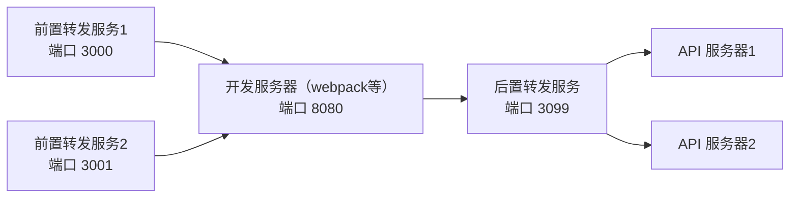

[![npm][npm]][npm-url]
[![node][node]][node-url]


# EnvManage - 环境管理工具

`EnvManage` 是一款强大的环境管理工具，专为管理和代理多个开发环境而设计，特别适用于需要同时运行多个开发环境的场景。无论是小型项目还是大型企业级应用，`EnvManage` 都能极大地提升开发效率，简化环境管理流程。



## 🌟 功能特性

- **请求代理**

  通过前置和后置代理，确保请求准确无误地转发到指定的开发服务器。代理服务器会依据配置的目标服务器地址，将请求精准转发到对应的 API 服务器，保障数据交互顺畅。

- **多服务器管理**

  轻松实现同时启动和管理多个开发服务器，并通过管理页面查看代理服务运行状态，同时可灵活启动或停止某个环境对应的服务器。

## 🚀 快速上手

### 安装

```bash
npm i -D env-manage-plugin
```

或者全局安装

```bash
npm i -g env-manage-plugin
```

### 启动

运行以下命令启动：

```bash
npx envm
```

访问管理页面 [http://localhost:3099/](http://localhost:3099/) 对各个代理服务进行管理。

1.  添加 `Dev Server`；
2.  添加 `API Server`;
3.  启动代理服务

### 开发服务器配置

调整开发服务器，将需要代理到 API 服务器的请求，转发到 后置代理服务器。

**webpack-dev-server**

```js
// webpack.config.js

module.exports = {
  devServer: {
    proxy: {
      "/api/test": "http://localhost:3099",
    },
  },
};
```

**vite**

```js
// vite.config.js
import { defineConfig } from "vite";

// https://vite.dev/config/
export default defineConfig({
  server: {
    proxy: {
      "/api/test": {
        target: "http://localhost:3099",
        changeOrigin: true,
      },
    },
  },
});
```

### 配置

#### 支持的配置项

| 配置项       | 类型   | 描述                                                             | 默认值          |
| ------------ | ------ | ---------------------------------------------------------------- | --------------- |
| port         | number | 服务启动端口                                                     | 3099            |
| apiPrefix    | string | 管理页面 API 接口前缀（如果与 API URL 冲突可调整，一般无需调整） | /dev-manage-api |
| cookieSuffix | string | Cookie 名称后缀                                                  | envm            |
| logLevel     | string | 日志级别（debug/info/warn/error）                                | info            |

#### 配置方式（按优先级从高到低）

1. 动态传入参数

在初始化时通过代码传入，优先级最高：

> 可以通过 npx envm -h 查看参数详情

```cmd
npx envm -p 3000
```

2. 环境变量

在 `.env` 文件中配置，优先级次之：

> 为了防止与其它应用配置冲突，增加了 envm\_ 前缀

```env
// .env
# 示例：设置端口
envm_port=3000
envm_apiPrefix=/api
envm_cookieSuffix=envm
envm_logLevel=info
```

3. package.json 配置

在项目 package.json 中添加 envm 字段，优先级最低：

```json
{
  "envm": {
    "port": 5000
  }
}
```

### 作为插件启动

`env-manage-plugin` 使用 [Unplugin](https://unplugin.unjs.io) 为各种构建工具提供统一插件，作为插件启动。

#### webpack

```js
// webpack.config.js
import { envmWebpackPlugin } from "env-manage-plugin";

export default {
  plugins: [
    envmWebpackPlugin({
      port: 3000,
    }),
  ],
  // .... 其它配置
};
```

#### vite

```js
// vite.config.js
import { defineConfig } from "vite";
import { envmVitePlugin } from "env-manage-plugin";

// https://vite.dev/config/
export default defineConfig({
  plugins: [envmVitePlugin()],
  // ... 其它配置
});
```

> 支持工具 vite,rollup,rolldown,webpack,rspack,esbuild,farm

### Cookie 代理

由于 `Cookie` 在同主机的不同端口会进行共享，从而导致不同环境的登录失效，故支持 `Cookie` 代理功能。

例如： 在 `localhost:3001` 端口登录 `环境A`，然后在 `localhost:3002` 登录 `环境B`；第二次登录的 `set-cookie` 操作，会覆盖 `环境A` 的登录操作设置的 `Cookie`。导致 `3001` 端口对 `环境A` 的登录失效。故设置此功能，将不同端口的登录 `Cookie` 分开存储，并在请求时替换成对应环境的 `Cookie`。

其它：

1. 通过管理页面的 `清除所有代理 Cookie` 按钮可以清除所有保存的代理`Cookie`。

建议：

1. 建议将生成的环境数据文件 .envm.data.json 加入 .gitignore，无需提交版本控制

## 许可证

本项目采用 MIT 许可证。详情请参阅 [LICENSE](LICENSE) 文件。

## 贡献

欢迎提交 Issue 和 Pull Request。请在提交之前阅读 [贡献指南](CONTRIBUTING.md)。

## 作者

- [helloskynet](https://github.com/helloskynet)

---

感谢使用 `EnvManage`！如果你有任何问题或建议，请随时联系我们。

[npm]: https://img.shields.io/npm/v/env-manage-plugin.svg?logo=npm
[npm-url]: https://npmjs.com/package/env-manage-plugin
[node]: https://img.shields.io/node/v/env-manage-plugin.svg?logo=node.js
[node-url]: https://nodejs.org

这个怎么样？
