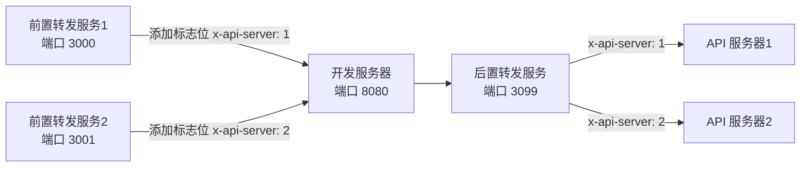

# EnvManage - 环境管理工具

`EnvManage` 是一个用于管理和代理多个开发环境的工具。它允许你通过配置文件动态启动、停止和管理多个开发服务器，并通过代理中间件将请求转发到相应的服务器。该工具特别适用于需要同时运行多个开发环境的场景。



## 功能特性

- **动态环境管理**：通过配置文件动态管理多个开发环境。
- **请求代理**：支持前置和后置代理，将请求转发到指定的开发服务器。
- **配置文件热更新**：支持配置文件的热更新，修改配置文件后无需重启服务。
- **多服务器管理**：可以同时启动和管理多个开发服务器，并通过 API 进行控制。

## 安装

1. 安装项目。

   ```bash
   npm i -D envmange
   ```

   或者全局安装

   ```bash
   npm i -g envmange
   ```

2. 在项目根目录下创建 `env.config.js` 配置文件。

## 配置文件示例

在项目根目录下创建 `env.config.js` 文件，配置示例如下：

```javascript
module.exports = {
  port: 3099, // 管理服务器的端口
  devServerUrl: "http://localhost:5173", // 默认的开发服务器地址
  basePath: "/dev-manage-api", // 管理 API 的基础路径
  envList: [
    {
      name: "env1", // 环境名称
      port: 3001, // 环境端口
      target: "http://localhost:3001", // 目标服务器地址
      devServerId: "0", // 关联的开发服务器 ID
      router: (req, env) => {
        // 自定义target
        return env.target;
      },
    },
    {
      name: "env2",
      port: 3002,
      target: "http://localhost:3002",
      devServerId: "1",
    },
  ],
  devServerList: [
    {
      name: "devServer1", // 开发服务器名称
      target: "http://localhost:5173", // 开发服务器地址
    },
    {
      name: "devServer2",
      target: "http://localhost:5174",
    },
  ],
};
```

## 开发服务器配置

将需要代理到 API 服务器的请求，转发到 后置代理服务器。

### webpack-dev-server

```js
// webpack.config.js

module.exports = {
  devServer: {
    proxy: {
      "/two": "http://localhost:3099",
    },
  },
};
```

### vite

```js
// vite.config.js
import { defineConfig } from "vite";

// https://vite.dev/config/
export default defineConfig({
  server: {
    proxy: {
      "/dev-manage-api": {
        target: "http://localhost:3099",
        changeOrigin: true,
      },
      "/simple": {
        target: "http://localhost:3099",
        changeOrigin: true,
      },
      "/two": {
        target: "http://localhost:3099",
        changeOrigin: true,
      },
    },
  },
});
```

## 使用说明

### 启动管理服务器

在项目根目录下运行以下命令启动管理服务器：

```bash
npx envmange
```

或者通过命令行参数指定配置文件路径：

```bash
npx envmanage --config ./path/to/env.config.js
```

### 配置文件热更新

当 env.config.js 文件发生变化时，管理服务器会自动重新加载配置，无需重启服务。

## 依赖

- `express`: Web 框架，用于创建和管理服务器。
- `http-proxy-middleware`: 用于创建代理中间件，转发请求到目标服务器。
- `chokidar`: 用于监听配置文件的变化，实现热更新。
- `yargs`: 用于解析命令行参数。

## 许可证

本项目采用 MIT 许可证。详情请参阅 [LICENSE](LICENSE) 文件。

## 贡献

欢迎提交 Issue 和 Pull Request。请在提交之前阅读 [贡献指南](CONTRIBUTING.md)。

## 作者

- [Your Name](https://github.com/yourusername)

---

感谢使用 `EnvManage`！如果你有任何问题或建议，请随时联系我们。
