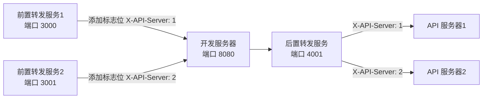

使用 express + http-proxy-middleware 实现多开发环境管理

端口 3000 （前置转发服务1） ---> 端口 8080（开发服务器） --> 端口 4001 （后置转发服务） --> API 服务器1
端口 3001 （前置转发服务2） ---> 端口 8080（开发服务器） --> 端口 4001 （后置转发服务） --> API 服务器2

前置转发服务，将请求转发到 开发服务，同时在header 中添加标志位，开发服务将请求转发到后置转发服务，
后置转发服务中间件 根据 header 中的标志位 转发到不同的的API 服务。

## 添加管理页面