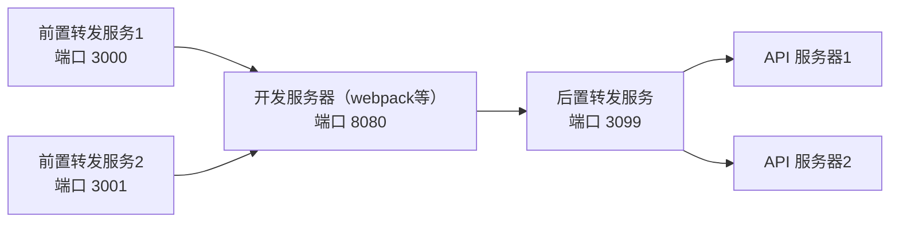

[![npm][npm]][npm-url]
[![node][node]][node-url]


# EnvManage - 环境管理工具

`EnvManage` 是一款强大的环境管理工具，专为管理和代理多个开发环境而设计，特别适用于需要同时运行多个开发环境的场景。无论是小型项目还是大型企业级应用，`EnvManage` 都能极大地提升开发效率，简化环境管理流程。



## 🌟功能特性

- **动态环境管理**

  通过简单的配置文件 `envm.config.js`，您可以轻松定义和管理多个开发环境。在该文件中，您能灵活设置不同环境的名称、端口、目标服务器地址等关键信息，实现对各个开发环境的精准区分与高效管理。

- **请求代理**

  支持前置和后置代理，确保请求准确无误地转发到指定的开发服务器。代理服务器会依据配置的目标服务器地址，将请求精准转发到对应的 API 服务器，保障数据交互顺畅。

- **配置文件热更新**

  无需繁琐的重启服务操作，`EnvManage` 支持配置文件热更新。当您对配置文件进行修改后，工具会自动检测并应用新的配置，显著提高开发效率，让您的开发过程更加流畅。

- **多服务器管理**

  轻松实现同时启动和管理多个开发服务器，并通过管理页面查看代理服务运行状态，同时可灵活启动或停止某个环境对应的服务器。

## 🚀 快速上手

### 安装

```bash
npm i -D env-manage-plugin
```

或者全局安装

```bash
npm i -g env-manage-plugin
```

### 配置

在项目根目录下创建 `envm.config.js` 文件，根据实际需求定义开发环境和开发服务器列表。

> 可以使用 `npx envm init` 命令快速初始化配置文件。

**配置文件示例**

```js
// envm.config.js  支持CommonJS 和 ES Module
export default {
  // 管理服务器运行的端口，可根据实际需求修改，确保该端口未被其他程序占用
  port: 3099,
  // 基础路径，用于构建管理API请求的前缀，如果与业务相关接口冲突可调整此配置
  basePath: "/dev-manage-api",
  // 环境的索引路径，可作为环境的首页路径或特定的入口路径，可以被 envList 中的覆盖
  indexPage: "/Test",
  // 是否开启 cookie 的代理
  isEnableCookieProxy: true,
  // 开发服务器列表
  devServerList: [
    {
      // 为开发服务器命名，便于识别和管理，名称可自定义
      // prima key
      name: "your_dev_server_1",
      // 该开发服务器对应的目标地址，即实际提供服务的地址
      target: "http://localhost:5173",
    },
    // 可以添加更多开发服务器
  ],
  envList: [
    {
      // 为开发环境命名，如开发环境、测试环境等，方便区分
      // prima key
      name: "your_env_1",
      // 该环境对外暴露的端口，用于访问该环境下的应用
      // prima key
      port: 3000,
      // 该环境请求转发的目标服务器地址，通常是后端 API 服务地址
      target: "http://localhost:3010",
      // 环境的索引路径，可作为该环境的首页路径或特定的入口路径
      indexPage: "/Test",
      // 是否开启 cookie 的代理
      isEnableCookieProxy: true,
      // 关联的开发服务器Name 未设置时 默认为第一个
      devServerName: "your_dev_server_1",
      // 路由规则函数，根据请求和环境信息，返回请求应转发到的目标地址
      // 自定义 目标地址 可以覆盖 target 未提供时，使用target
      router: (req, env) => {
        return env.target;
      },
    },
    // 可以添加更多环境
  ],
};
```

> router 配置同 [http-proxy-middleware 的 router 选项](https://www.npmjs.com/package/http-proxy-middleware#router-objectfunction)，不过不支持对象形式，函数会额外传递第二个参数，代表当前envItem

**envList**

envList 的主键组合为 name 和 port 。若数据完全相同，则后一条数据会被忽略。对于 port 相同的情况，系统会自动进行互斥处理，即启动其中一个后，再尝试启动其他相同 port 的实例时，系统会自动关闭已启动的实例，避免冲突。

**devServerList**

devServerList 的主键为 name，相同则忽略后一个。

### 开发服务器配置

调整开发服务器，将需要代理到 API 服务器的请求，转发到 后置代理服务器。

**webpack-dev-server**

```js
// webpack.config.js

module.exports = {
  devServer: {
    proxy: {
      "/two": "http://localhost:3099",
    },
  },
};
```

**vite**

```js
// vite.config.js
import { defineConfig } from "vite";

// https://vite.dev/config/
export default defineConfig({
  server: {
    proxy: {
      "/dev-manage-api": {
        target: "http://localhost:3099",
        changeOrigin: true,
      },
      "/simple": {
        target: "http://localhost:3099",
        changeOrigin: true,
      },
      "/two": {
        target: "http://localhost:3099",
        changeOrigin: true,
      },
    },
  },
});
```

### 独立启动

运行以下命令启动管理服务器：

```bash
npx envm
```

或者通过命令行参数指定配置文件路径：

```bash
npx envm --config ./path/to/envm.config.js
```

> 未指定 config 时，默认搜索当前文件夹下的 `envm.config.[m]js`

访问管理页面 [http://localhost:3099/](http://localhost:3099/) 对各个代理服务进行管理。

### 作为插件启动

`env-manage-plugin` 使用 [Unplugin](https://unplugin.unjs.io) 为各种构建工具提供统一插件，作为插件启动。

#### webpack

```js
// webpack.config.js
import { envmWebpackPlugin } from "env-manage-plugin";

export default {
  plugins: [
    envmWebpackPlugin({
      config: "./envm.config.mjs",
    }),
  ],
  // .... 其它配置
};
```

#### vite

```js
// vite.config.js
import { defineConfig } from "vite";
import { envmVitePlugin } from "env-manage-plugin";

// https://vite.dev/config/
export default defineConfig({
  plugins: [envmVitePlugin()],
  // ... 其它配置
});
```

> 支持工具 vite,rollup,rolldown,webpack,rspack,esbuild,farm

### 配置文件热更新

如果需要修改环境配置，直接修改 `envm.config.js` 文件，工具支持热更新，修改后无需重启服务即可生效。

### Cookie 代理

由于 `Cookie` 在同主机的不同端口会进行共享，从而导致不同环境的登录失效，故支持 `Cookie` 代理功能。

例如： 在 `localhost:3001` 端口登录 `环境A`，然后在 `localhost:3002` 登录 `环境B`；第二次登录的 `set-cookie` 操作，会覆盖 `环境A` 的登录操作设置的 `Cookie`。导致 `3001` 端口对 `环境A` 的登录失效。故设置此功能，将不同端口的登录 `Cookie` 分开存储，并在请求时替换成对应环境的 `Cookie`。

其它：

1. 通过配置项 `isEnableCookieProxy` 可以控制此功能的是否开启，默认开启；
2. 通过管理页面的 `清除所有代理 Cookie` 按钮可以清除所有保存的代理`Cookie`。

## 依赖

- `express`: Web 框架，用于创建和管理服务器。
- `http-proxy-middleware`: 用于创建代理中间件，转发请求到目标服务器。
- `chokidar`: 用于监听配置文件的变化，实现热更新。
- `commander`: 用于解析命令行参数。

## 许可证

本项目采用 MIT 许可证。详情请参阅 [LICENSE](LICENSE) 文件。

## 贡献

欢迎提交 Issue 和 Pull Request。请在提交之前阅读 [贡献指南](CONTRIBUTING.md)。

## 作者

- [helloskynet](https://github.com/helloskynet)

---

感谢使用 `EnvManage`！如果你有任何问题或建议，请随时联系我们。

[npm]: https://img.shields.io/npm/v/env-manage-plugin.svg?logo=npm
[npm-url]: https://npmjs.com/package/env-manage-plugin
[node]: https://img.shields.io/node/v/env-manage-plugin.svg?logo=node.js
[node-url]: https://nodejs.org
